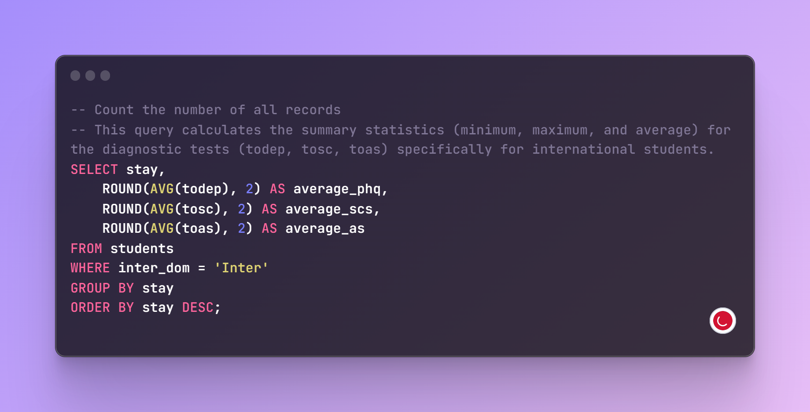
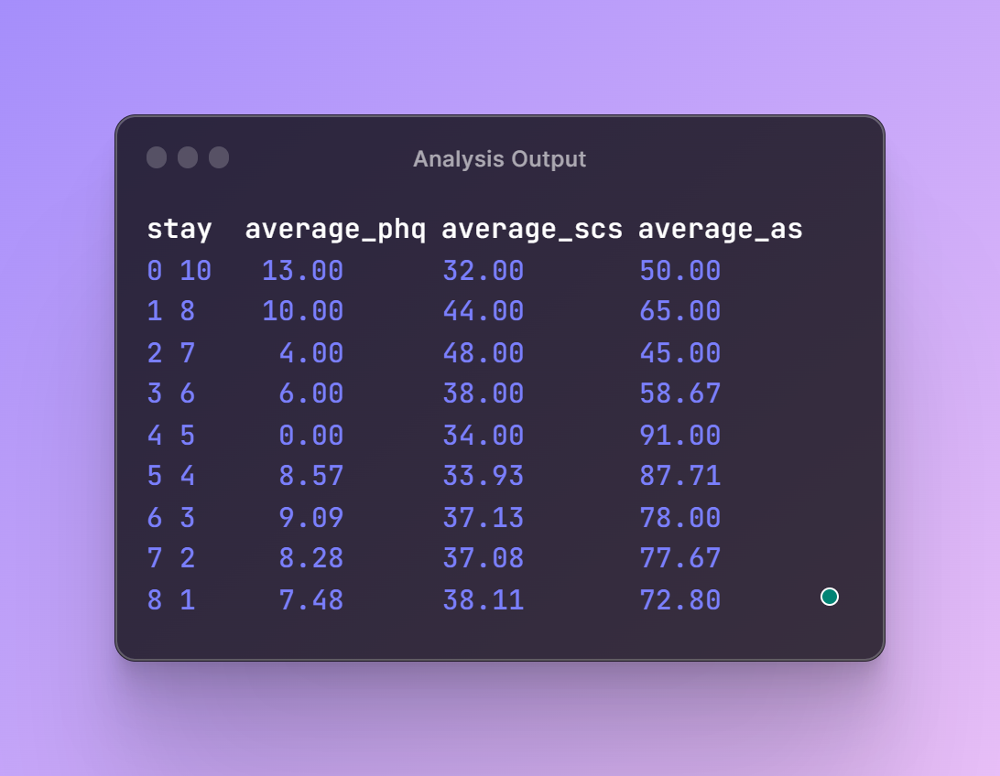

# SQL Analysis Project: Exploring Mental Health of International Students

📚 This project aims to analyze the mental health of international students at a Japanese university using SQL. The study was conducted in 2018 and published the following year, approved by various ethical and regulatory boards.

🔍 The objective is to investigate whether studying in a different country affects the mental health of students, with a focus on the length of stay as a contributing factor.

## 📋 Data Description

Does going to university in a different country affect your mental health? A Japanese international university surveyed its students in 2018 and published a study the following year that was approved by several ethical and regulatory boards.

The study found that international students have a higher risk of mental health difficulties than the general population. Explore the `students` data using PostgreSQL to find out if this is true and see if the length of stay is a contributing factor.

Here is a data description of the columns you may find helpful.

| Field Name    | Description                                      | 
| ------------- | ------------------------------------------------ |
| inter_dom     | Types of students                                |
| japanese_cate | Japanese language proficiency                    | 
| english_cate  | English language proficiency                     |
| academic      | Current academic level                           | 
| age           | Current age of student                           |
| stay          | Current length of stay in years                  |
| todep         | Total score of depression (PHQ-9 test)           |
| tosc          | Total score of social connectedness (SCS test)   |
| toas          | Total score of Acculturative Stress (ASISS test) |

## 📊 Exploratory Analysis

To gain insights into the mental health of international students, the following steps were performed using SQL:

1. Counted the number of records in the dataset and per student type.
2. Filtered the data to compare student types.
3. Calculated summary statistics for diagnostic tests for all students.
4. Analyzed the diagnostic test scores for international students.
5. Investigated if the length of stay impacts the test scores for domestic students.

## 🧪 Results and Findings

The analysis revealed the following:

- The dataset consists of 268 student records.
- There are 150 international students and 118 domestic students.
- International students show higher risks of mental health difficulties compared to the general population.
- The average scores for depression, social connectedness, and acculturative stress were calculated for all students and specifically for international students.
## 🔎Findings 

- 🌍🎓 International Student Mental Health Analysis 🧠📊

- 📈 Exploring the data on international student mental health based on their length of stay, we uncover fascinating insights. Let's dive in!

- 📊 The PHQ-9 test, measuring the average score of depression, shows an intriguing trend. As international students spend more time abroad, the average score gradually increases from 0 to 13, indicating a rise in   reported symptoms of depression. This raises concerns about the potential impact of the foreign environment on their mental well-being. 😔📉

- 🤝 The SCS test, capturing the average score of social connectedness, presents a unique pattern. Starting at 34, the score slightly declines to 32 after 5 years of stay. This decline suggests the challenges that international students may face in maintaining social connections as they adapt to a new cultural context. 💔📉

- 😰 Acculturative stress, measured by the ASISS test, exhibits a notable shift. The average score decreases from 91 to 50 as the length of stay increases from 5 to 10 years. This reduction in acculturative stress levels could indicate the gradual adjustment and adaptation to the new cultural environment. 🌱😓 

📝 In summary, as international students stay longer, there is a noticeable increase in reported symptoms of depression (PHQ-9). The score of social connectedness (SCS) experiences a slight decline, highlighting the challenges in maintaining social relationships. Additionally, the score of acculturative stress (ASISS) significantly decreases, suggesting a potential improvement in adapting to the new cultural environment.

🌍💙 These findings underscore the importance of comprehensive mental health support and cultural adjustment programs for international students, particularly during the early stages of their stay. By addressing these challenges, we can foster a more positive and supportive experience for international students worldwide.

## 📑 Queries and Code

The SQL queries used in this project can be found in the [jupyter notebook](students_mental_health.ipynb) file. 

### 🧑‍💻 Query example: 

### 👨‍🔬 Query output: 

## 📚 References

The study and dataset used in this project are based on the research conducted by [Japanese International University](example-link-to-the-study).

---

This project provides valuable insights into the mental health of international students at a Japanese university. By analyzing the data using SQL, we were able to explore the impact of studying in a different country and the role of the length of stay. Feel free to explore the queries and findings to deepen your understanding of the subject matter.
